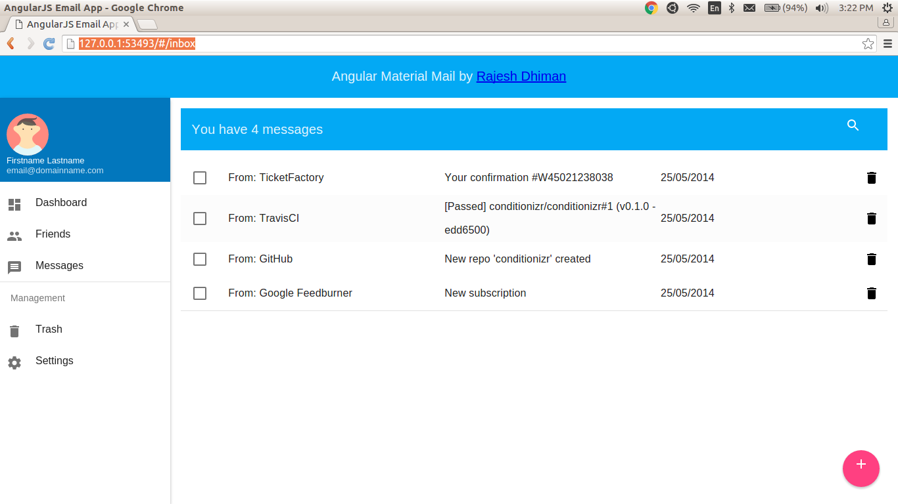
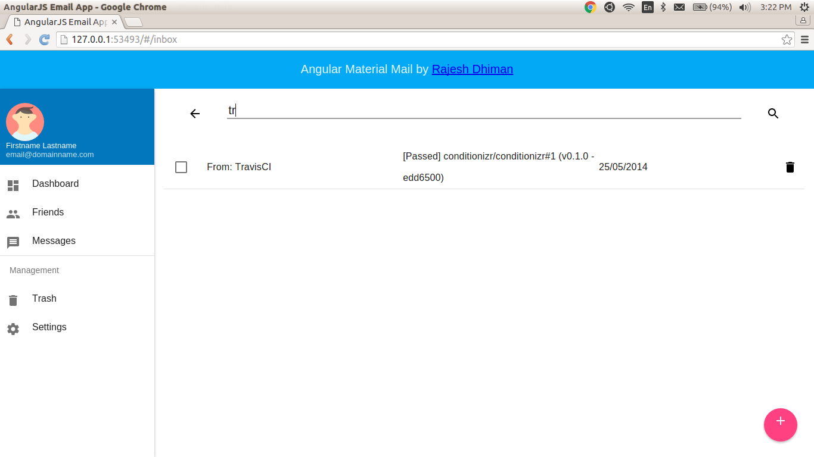
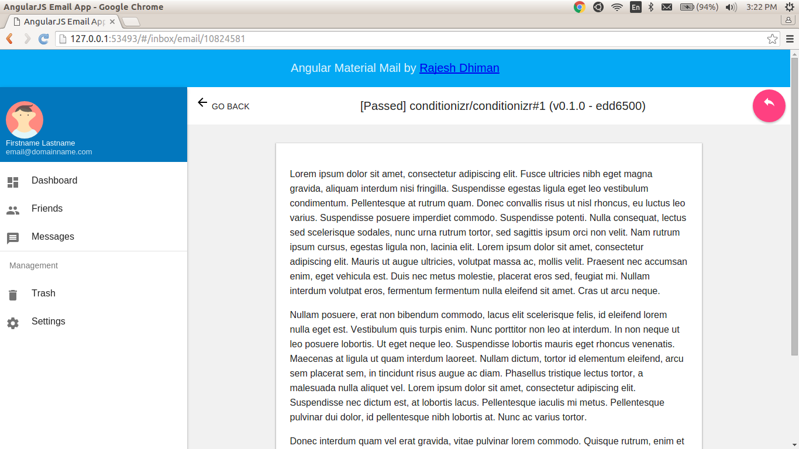

# Angular material email client design
A Mail client showcasing basic angular components and angular material design. 

## Motivation

Inpired from this [tutorial](https://www.thinkful.com/learn/angularjs-tutorial-build-a-gmail-clone/)  I have added a material design to the application. 

## Angular Section Covered

This application covers Controllers, Factories, Custom Directives, html templates, basic filtering, $http requests, routing etc. in angular js. 

## Screenshots

